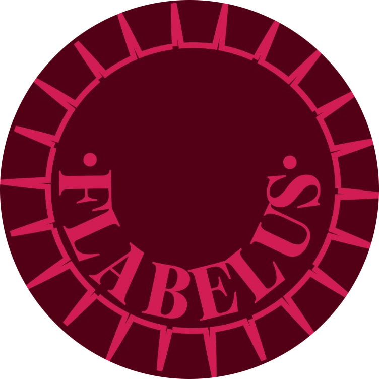

# Flabelus Retail App (Android Only for Now)

The **Flabelus Retail App** is a personal project designed specifically for the retail stores of the Spanish shoe company, Flabelus. While this app is unofficial and not currently in use by the company, it serves as a practical tool for managing store inventories, with a focus on enhancing sales processes. 

This project is still in its **very early stages of development**, focusing on building core functionality for Android first. Future plans include extending support to iOS.

## Project Overview

The Flabelus Retail App is designed to streamline in-store operations with an intuitive interface to:
- **Log In**: A secure log in screen for store clerks and administrators.
- **View Stock**: A complete list of all shoe models available in-store.
- **Add New Models**: A form to add new shoe models to the inventory.
- **Settings**: Custom settings for app configuration (upcoming features).

### Features in Development
- **Expanded Inventory Management**: Ability to make sales by selecting shoe models and recording quantities sold, alongside more advanced inventory tools.
- **Store Selection**: Users will be able to select the store location they are working from (e.g., Madrid, Lisbon), with inventory data adjusted accordingly.
- **User Roles**: Different user roles (Admin, Store Clerk, CEO) with customizable UI based on the user's role.
- **iOS Support**: While the app is currently Android-only, iOS support will be added in the future (no near-term release planned).

## Current Status

The project is in **very early development** and currently focuses only on the Android version. The initial version is being developed in Java, with plans to transition to **Kotlin** in the near future.

An **initial version** of the app, featuring core functionalities such as inventory viewing and adding new models, is expected to be released in the near future. This will serve as a foundation for further development and feature enhancements.

## Tech Stack

- **Android**: Java (Kotlin transition planned)
- **Design**: Material Design 3 (Material You)
- **Database**: SQLite (in progress)

## Installation

*Currently, there is no installation guide available as the project is still in development.* Once the initial Android version is ready for testing, an installation guide will be provided.

## License

This project is under a Proprietary License and is not open for modification or distribution at this time. The full license will be added once the project progresses.
