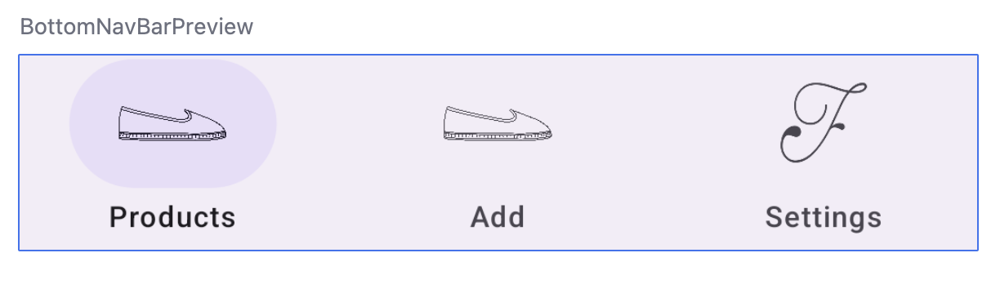

# International Retail Management App for Flabelus 🩷
<!-- Centered badges -->

    
    
    

---

## 🛍️ **What is it?**

<b>Android app developed as a scalable business solution</b> for the retail stores of <b>Flabelus</b>, a rapidly growing international shoe company based in Madrid. 🩰

✅ **Manages inventory** for shoes and apparel across multiple stores & regions. ✈️  
✅ **Each store has its own** employees (with login access), stock levels, and regional settings.  
✅ **Distinct user roles**: Store clerks, regional managers, and more. 🤵🏼‍♀️  
✅ **Tracks store performance & employee activity** with built-in statistics. 📈  
✅ **Built for scalability**, supporting new stores & product categories as Flabelus expands. 🌍  

<i>Although <b>not officially adopted by Flabelus</b>, this app showcases my passion for their products and my dedication to developing real-world business solutions beyond just coding.</i>

---

## 🤔 **Why This Project?**
Flabelus has grown from a **single store in Madrid** to an **international brand**, requiring a **scalable solution** for store management.  

✨ **What makes this app unique?**  
✔ **Blends Flabelus’ colors** with **Material 3** for a premium UI.  
✔ **Designed to integrate with Shopify** (future plans) while fully functional as a standalone system.  

---

## 📊 Project status
### **📡 Backend (Django API)**
✅ **Database structure ready**, with implemented API endpoints (some still planned).  
✅ **Previously deployed on Render, now transitioning to local testing.**  
✅ **Ongoing development**, with refinements & additional endpoints in progress.  

### **📱 Frontend (Android App)**
✅ **Connected to the local API**, with endpoints structured around app flow.  
✅ **UI is being redesigned from scratch in Figma, ensuring a polished Material 3 experience.**  
✅ **Currently collecting assets & preparing for full implementation.**  

---

## 📷 **Sneak Peek: Navigation Bar Prototype**
A **first look** at the bottom navigation bar!  
🛠️ **Work in progress:** The icons and styling might change, but this gives an idea of the **Material 3 approach** the app is taking!  
🔤 The **selected item should be bold**, but this is still under development.

  

---

## Disclaimer

This repository includes selected files to showcase the app’s design, architecture, and core features. Sensitive files such as API integrations, database operations, and other proprietary logic have been excluded to protect security and intellectual property.

The provided files highlight the UI and example Kotlin implementations, demonstrating my approach to scalable app development.

⚠️ Asset Attribution:  
Some assets used in this project, including logos, brand elements, and certain design assets, are the property of Flabelus. These materials are used solely for demonstration purposes to maintain brand consistency within the app’s design. I do not claim ownership of these assets, nor is this project officially affiliated with or endorsed by Flabelus.

For any inquiries or concerns regarding the use of these assets, feel free to contact me.

## License

This project is licensed under the [Apache License 2.0](LICENSE). You are free to use, modify, and distribute the code, provided you comply with the terms of the license, including attribution.

Please note that sensitive files have been excluded from this repository for security and intellectual property reasons. See the **Disclaimer** section for more details.
